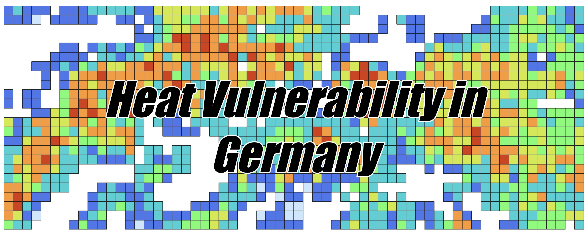
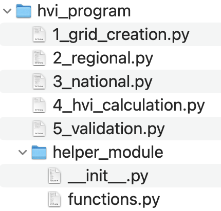

<hr>

### Table of Contents
- [What's it about?](#whats-it-about)
- [Files](#files)
- [Installation Guide](#installation-guide)
- [Contact Information](#contact-information)

# What's it about?
This repository contains a Python based workflow to map the heat vulnerability in Germany using the Heat Vulnerability Index (HVI). This approach is mainly based on [Reid et al. 2009](https://www.ncbi.nlm.nih.gov/pmc/articles/PMC2801183/) using the Z-Score.<br>

## Files




To calculate the HVI, the workflow consists of five main steps which you can find in the `hvi_program` directory. Each number of the Python script represents the order of the workflow. It is important that the workflow is executed in the given order, because the scripts depend on the outputs of each other.

The helper package stores `functions.py` that contains all functions and the `__init__.py` file. These are the main files that are needed to compute the local and/or national HVI for Germany.

## Installation Guide

The repository is written in [Python 3](https://www.python.org/) and requires conda as a package manager. See [here](https://conda.io/projects/conda/en/latest/user-guide/install/index.html) to install miniconda on your machine.<br>
If the installation of miniconda was successful, create an conda environment like this:

```
conda create --name hvi python=3.9.15
conda activate hvi
```

Once the new conda environment is activated start installing the required libraries which are [dask](https://www.dask.org/), [geocube](https://corteva.github.io/geocube/latest/), [geopandas](https://geopandas.org/en/stable/), [matplotlib](https://matplotlib.org/), [numpy](https://numpy.org/), [osgeo](https://pypi.org/project/osgeo/), [pandas](https://pandas.pydata.org/), [rasterio](https://pypi.org/project/rasterio/), [scipy](https://scipy.org/), [seaborn](https://seaborn.pydata.org/), [shapely](https://pypi.org/project/shapely/). Make sure that your new conda  environment is activated. Install the following packages in the new enviroment like this:

```
conda install dask geocube geopandas matplotlib numpy gdal pandas rasterio scipy seaborn shapely
```

Now [clone](https://docs.github.com/en/repositories/creating-and-managing-repositories/cloning-a-repository) or [fork](https://docs.github.com/en/pull-requests/collaborating-with-pull-requests/working-with-forks/fork-a-repo) the repository to your local machine. An example can be this:

```
git clone https://github.com/chpfaff98/HVI_for_Germany
```
Everything should be ready now!

## Contact Information

This approach was delevoped in cooperation with the [LUP Potsdam](https://www.lup-umwelt.de/) within the [Urban Green Eye](http://urbangreeneye.de/) project. For questions or special requests please write an mail to Christian Pfaff (chpfaff@uni-potsdam.de) or the Head of the Remote Sensing Department of the LUP Annett Frick (annett.frick@lup-umwelt.de).

<hr>

[Go to top](#table-of-contents)
